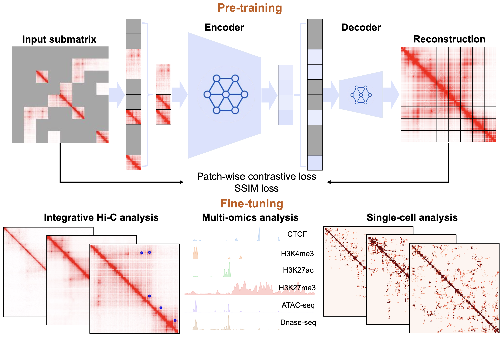

# HiCFoundation

<a href="https://github.com/marktext/marktext/releases/latest">
   
   
   
   
</a>  

HiCFoundation is a generalizable Hi-C foundation model for chromatin architecture, single-cell and multi-omics analysis across species.

Copyright (C) 2024 Xiao Wang, Yuanyuan Zhang, Suhita Ray, Anupama Jha, Tangqi Fang, Shengqi Hang, Sergei Doulatov, William Stafford Noble, and Sheng Wang

License: Apache License 2.0

Contact:  Sergei Doulatov (doulatov@uw.edu) & William Stafford Noble (wnoble@uw.edu) & Sheng Wang (swang@cs.washington.edu)

For technical problems or questions, please reach to Xiao Wang (wang3702@uw.edu) and Yuanyuan Zhang (zhang038@purdue.edu).

## Citation:
Xiao Wang, Yuanyuan Zhang, Suhita Ray, Anupama Jha, Tangqi Fang, Shengqi Hang, Sergei Doulatov, William Stafford Noble, & Sheng Wang. A generalizable Hi-C foundation model for chromatin architecture, single-cell and multi-omics analysis across species. bioRxiv, 2024. [Paper]()
<br>
```
@article{wang2024hicfoundation,   
  title={A generalizable Hi-C foundation model for chromatin architecture, single-cell and multi-omics analysis across species},   
  author={Xiao Wang, Yuanyuan Zhang, Suhita Ray, Anupama Jha, Tangqi Fang, Shengqi Hang, Sergei Doulatov, William Stafford Noble, and Sheng Wang},    
  journal={bioRxiv},    
  year={2024}    
}   
```

## Introduction

<details>
   <summary>HiCFoundation is a generalizable Hi-C foundation model for chromatin architecture, single-cell and multi-omics analysis across species. </summary>
The genetic information within nuclear DNA is organized into a compact three-dimensional (3D) structure that impacts critical cellular processes.
High-throughput chromosome conformation capture (Hi-C) stands as the most widely used method for measuring 3D genome architecture, while linear epigenomic assays, such as ATAC-seq, DNase-seq, and ChIP-seq, are extensively employed to characterize genome regulatory activities.
However, the integrative analysis of chromatin interactions and associated gene regulatory mechanisms remains challenging due to the mismatched resolution between Hi-C and epigenomic assays, as well as inconsistencies among analysis tools.
Here we propose HiCFoundation, a Hi-C-based foundation model for genome architecture and regulatory functions analysis. 
HiCFoundation is trained from hundreds of Hi-C assays encompassing 118 million contact matrix patches. 
The model achieves state-of-the-art performance in multiple types of 3D genome analysis, including reproducibility analysis, resolution enhancement, and loop detection, offering high efficiency and broad applicability. 
We further demonstrate the model's generalizability to genome architecture analysis of 316 species.
Notably, by enabling analysis of low-coverage experimental data, HiCFoundation reveals genome-wide loop loss during differentiation of HSPCs to neutrophil. 
Additionally, HiCFoundation is able to predict multiple gene regulatory activities from Hi-C input by generating epigenomic assays, and further offers interpretable analysis to reveal the relationship between chromatin conformation and genome function. 
Finally, HiCFoundation can analyze single cell Hi-C data, shedding light on genome structure at single-cell resolution.
HiCFoundation thus provides a unified, efficient, generalizable, and interpretable foundation for integrative, multi-species, single-cell, and multi-omics analyses, paving the path for systematically studying genome 3D architecture and its regulatory mechanisms.

</details>

## Overall Protocol 
<details>
<br>
1) Pre-training stage: the model is trained in a self-supervised fashion on massive quantities of unlabeled Hi-C data. 
The model takes masked Hi-C submatrices as input, optimizing for the reconstruction of the full submatrix.
<br>
2) Fine-tuning stage: the model is fine-tuned and tested for diverse downstream tasks, including integrative Hi-C analysis, multi-omics analysis, and single-cell analysis.

<p align="center">
  
</p>
</details>

## Installation

<details>

### System Requirements
- **CPU**: 4 cores or higher
- **Memory**: 12GB RAM or higher
- **GPU**: CUDA-compatible with minimum 12GB memory
- **Note**: GPU is mandatory as HiCFoundation

## Installation  
### 1. [`Install git`](https://git-scm.com/book/en/v2/Getting-Started-Installing-Git) 
### 2. Clone the repository in your computer 
```bash
git clone https://github.com/Noble-Lab/HiCFoundation.git && cd HiCFoundation
```

### 3. Configure environment for HiCFoundation.
##### 3.1 Install anaconda
Install anaconda from https://www.anaconda.com/download#downloads.
##### 3.2 Install environment via yml file
```bash
conda env create -f environment.yml
```
##### 3.3 Activate environment for running
Each time when you want to run HiCFoundation, simply activate the environment by
```bash
conda activate HiCFoundation
# To exit
conda deactivate
```

### 4. Download the trained HiCFoundation model
You can download our pre-trained and fine-tuned model to ``hicfoundation_model`` for inference, embedding generation and fine-tuning purposes. <br>
HiCFoundation model weights: [hicfoundation_model](https://huggingface.co/wang3702/hicfoundation_models/) <br>

You can also run the following command line to do this
```commandline
cd hicfoundation_model
wget https://huggingface.co/wang3702/hicfoundation_models/resolve/main/hicfoundation_pretrain.pth.tar
wget https://huggingface.co/wang3702/hicfoundation_models/resolve/main/hicfoundation_reproducibility.pth.tar
wget https://huggingface.co/wang3702/hicfoundation_models/resolve/main/hicfoundation_loop.pth.tar
wget https://huggingface.co/wang3702/hicfoundation_models/resolve/main/hicfoundation_loop_lc.pth.tar
wget https://huggingface.co/wang3702/hicfoundation_models/resolve/main/hicfoundation_resolution.pth.tar
wget https://huggingface.co/wang3702/hicfoundation_models/resolve/main/hicfoundation_epigenomic.pth.tar
wget https://huggingface.co/wang3702/hicfoundation_models/resolve/main/hicfoundation_schic.pth.tar
cd ..
```


### 5. (Optional) Visualization software
Juicebox: https://aidenlab.org/juicebox/

HiGlass: https://higlass.io/

</details>

# Usage

## Inference of fine-tuned HiCFoundation
<details>
<summary>Inference of HiCFoundation for chromatin architecture, multi-omics and single-cell analysis</summary>

### Overview
This include five different fine-tuned model for 
- Reproducibility analysis: HiCFoundation will generate embeddings of the input Hi-C, and the submatrix embeddings can be used to compare across biological replicates and non-replicates.
- Chromatin loop detection: HiCFoudation will generate the loop detection of the input Hi-C in .bedpe format.
- Resolution enhancement: HiCFoundation will generate enhanced Hi-C map given the input Hi-C.
- Epigenomic assay profiling: HiCFoundation will generate corressponding epigenomic assays in .bigWig format given the input Hi-C.
- Single-cell Hi-C enhancement: HiCFoundation will generate the enhanced scHi-C given the input siHi-C.

### Input format
HiCFoundation supports the .hic/.cool/.pkl/.txt/.pairs/.npy format.
- .hic/.cool: the common Hi-C format that stores the final matrix of Hi-C experiment
- .pkl: the pickle file that stores a dict of all Hi-C matrices, with the chrom name as key, and scipy.sparse/numpy array as the value. [chrom_name]:[matrix].
- .txt/.pairs: the pairs format text that records pairwise interactions in pairs format "#readID\tchr1\tpos1\tchr2\tpos2" that records the chr1:pos1 interactions with chr2:pos2.
- .npy format: a numpy array that records the contact map of a specific chromosome.

### Example
Please download the following files to the example folder for example testing purposes.<br>
- Low coverage Hi-C example: https://www.encodeproject.org/files/ENCFF689CUX/@@download/ENCFF689CUX.hic
- Low coverage Hi-C example2: https://www.ncbi.nlm.nih.gov/geo/download/?acc=GSE174533&format=file&file=GSE174533%5F1%2DC11%2DCB1%2E2%2DC11%2DCB2%2Emerge%2Ehic
- High coverage Hi-C example: https://data.4dnucleome.org/files-processed/4DNFITUOMFUQ/. (4DN requires authentication in for downloading, so please download in the webpage)
- Single-cell Hi-C example: https://www.ncbi.nlm.nih.gov/geo/query/acc.cgi?acc=GSM7006609 
(For single-cell Hi-C example, it is already kept in ``example`` directory, so you do not need to downlaod again.)

#### Other format examples
- .cool: https://data.4dnucleome.org/files-processed/4DNFI18UHVRO/ (4DN requires authentication in for downloading, so please download in the webpage)
- .txt/.pairs: [example/input.pairs](example/GSM7006527_ValaB8w4191.pairs) 
- .pkl: You can run [utils/hic2array.py](utils/hic2array.py) to convert .hic files to .pkl files to see .pkl format.
- .npy: You can use [numpy](https://numpy.org/) to save any 2D matrix to .npy file to run our inference. 


### Inference for different tasks
#### 1. Inference embeddings for reproducibility analysis
```
python3 inference.py --input [input_file] --batch_size [infer_batch_size] \
  --resolution [hic_resolution] --task 1 --input_row_size [input_submatrix_length] \
  --input_col_size [input_submatrix_width] --stride [stride] --bound [scan_boundary] \
  --model_path [trained_model_path] --output [output_dir] --gpu [gpu]
```
- input_file: a .hic/.cool/.pkl/.txt/.pairs/.npy file records Hi-C matrix.
- infer_batch_size: batch size of the input during inference, recommended: 4 for small GPU.
- hic_resolution: resolution of the input matrix, default: 25000 (25 kb for reproducibility task).
- input_submatrix_length: input submatrix row size, default: 224.
- input_submatrix_width: input submatrix column size, default: 224.
- stride: scanning stride for the input Hi-C matrix, default: 20.
- scan_boundary: off-diagonal bound for the scanning, default: 0.
- trained_model_path: load fine-tuned model for inference. Here the model should be [hicfoundation_reproducibility.pth.tar](hicfoundation_model/hicfoundation_reproducibility.pth.tar). Make sure you follow the installment instructions to download it before you run.
- output_dir: output directory to save the results, default: hicfoundation_inference.
- gpu: which gpu to use, default: None (will use all GPU). You can specify --gpu="0" to only use GPU 0, you can also specify --gpu="0,1" to use GPU0 and GPU1.
<br>
The output is saved in the ``output_dir``, where the embedding is saved in "HiCFoundation_reproducibility_embedding.pkl" in a dict format. <br>
The key of the dict is "chrom:row_index,col_index", and the value is the corresponding embedding. <br>
This embedding corresponds to the submatrix of [row_index:row_index+input_row_size, col_index:col_index+input_col_size] at chromsome ``chrom``.

##### Example command:
```
python3 inference.py --input example/ENCFF689CUX.hic --batch_size 4 --resolution 25000 \
  --task 1 --input_row_size 224 --input_col_size 224 --stride 20 --bound 0 \
  --model_path hicfoundation_model/hicfoundation_reproducibility.pth.tar \
  --output hicfoundation_inference/reproducibility_analysis/ --gpu "0"
```
This uses the low-coverage example ``ENCFF689CUX.hic`` to run the inference. <br>
The output embedding is saved in ``hicfoundation_inference/reproducibility_analysis/HiCFoundation_reproducibility_embedding.pkl``.

#### 2. Inference for chromatin loop detection
```
python3 inference.py --input [input_file] --batch_size [infer_batch_size] --resolution [hic_resolution] \
  --task 2 --input_row_size [input_submatrix_length] --input_col_size [input_submatrix_width] \
  --stride [stride] --bound [scan_boundary] --model_path [trained_model_path] \
  --output [output_dir] --gpu [gpu]
```
- input_file: a .hic/.cool/.pkl/.txt/.pairs/.npy file records Hi-C matrix.
- infer_batch_size: batch size of the input during inference, recommended: 4 for small GPU.
- hic_resolution: resolution of the input matrix, default: 10000 (10 kb for loop detection).
- input_submatrix_length: input submatrix row size, default: 224.
- input_submatrix_width: input submatrix column size, default: 224.
- stride: scanning stride for the input Hi-C matrix, default: 20.
- scan_boundary: off-diagonal bound for the scanning, default: 0 (to save time). You can also use 200, the detection results should be similar.
- trained_model_path: load fine-tuned model for inference. Use "hicfoundation_loop.pth.tar" for high-coverage loop detection and "hicfoundation_loop_lc.pth.tar" for low-coverage loop detection. For human dataset, total reads smaller than 50M is treated as low-coverage, that equals to any experiments with less than around 200 reads per 10 kb. Here the model should be [hicfoundation_loop.pth.tar](hicfoundation_model/hicfoundation_loop.pth.tar) or [hicfoundation_loop_lc.pth.tar](hicfoundation_model/hicfoundation_loop_lc.pth.tar). Make sure you follow the installment instructions to download models before you run.
- output_dir: output directory to save the results, default: hicfoundation_inference.
- gpu: which gpu to use, default: None (will use all GPU). You can specify --gpu="0" to only use GPU 0, you can also specify --gpu="0,1" to use GPU0 and GPU1.
<br>
The output is saved in the ``output_dir``, where the loop is saved in HiCFoundation_loop_[threshold].bedpe. We kept three confidence level 0.5,0.75,0.9 for your choice. For conservative loop calls, we would recommend you to use 0.9 threshold for loop calls. For low-coverage Hi-C, we would recommend you to to use 0.5 threshold for loop calls. <br>
Each line records a loop calls in the .bedpe file in format of [chr1 x1 x2 chr2 y1 y2], where chr1 typically is the same as chr2; [x1 x2] records the spanning region of left loop anchor, [y1 y2] records the spanning region of the right loop anchor.

##### Example command:
Loop calls from high-coverage Hi-C
```
python3 inference.py --input example/4DNFITUOMFUQ.hic --batch_size 4 --resolution 10000 \
  --task 2 --input_row_size 224 --input_col_size 224 --stride 20 --bound 0 \
  --model_path hicfoundation_model/hicfoundation_loop.pth.tar \
  --output hicfoundation_inference/loop_detection/ --gpu "0"
```
This uses the high-coverage example ``4DNFITUOMFUQ.hic`` to run the inference. <br>
The output loop detection is saved in ``hicfoundation_inference/loop_detection``. <br>
You can find HiCFoundation_loop_0.5.bedpe, HiCFoundation_loop_0.75.bedpe and HiCFoundation_loop_0.9.bedpe.  <br>
HiCFoundation_loop_0.9.bedpe includes the most confident loop calls. You can also choose HiCFoundation_loop_0.5.bedpe if you want more loop calls.

Loop calls from low-coverage Hi-C
```
python3 inference.py --input example/GSE174533_1-C11-CB1.2-C11-CB2.merge.hic \
--batch_size 4  --resolution 10000 --task 2 --input_row_size 224 \
--input_col_size 224 --stride 20 --bound 0 \
--model_path hicfoundation_model/ hicfoundation_loop_lc.pth.tar \
--output hicfoundation_inference/loop_detection_lc/ --gpu "0"
```
This uses the low-coverage example HSPC in [link](https://www.ncbi.nlm.nih.gov/geo/download/?acc=GSE174533&format=file&file=GSE174533%5F1%2DC11%2DCB1%2E2%2DC11%2DCB2%2Emerge%2Ehic)  to run loop calls at low coverage Hi-C. <br>
The output loop detection is saved in ``hicfoundation_inference/loop_detection_lc/HiCFoundation_loop_0.5.bedpe``. <br>
You can also check other more confident loop calls under ``hicfoundation_inference/loop_detection_lc`` directory.

#### 3. Inference for resolution enhancement
```
python3 inference.py --input [input_file] --batch_size [infer_batch_size] \
  --resolution [hic_resolution] --task 3 --input_row_size [input_submatrix_length] \
  --input_col_size [input_submatrix_width] --stride [stride] --bound [scan_boundary] \
  --model_path [trained_model_path] --output [output_dir] --gpu [gpu] --genome_id [genome_id]
```
- input_file: a .hic/.cool/.pkl/.txt/.pairs/.npy file records Hi-C matrix.
- infer_batch_size: batch size of the input during inference, recommended: 4 for small GPU.
- hic_resolution: resolution of the input matrix, default: 10000 (10 kb for resolution enhancement, should also work for 5kb).
- input_submatrix_length: input submatrix row size, default: 224.
- input_submatrix_width: input submatrix column size, default: 224.
- stride: scanning stride for the input Hi-C matrix, default: 20.
- scan_boundary: off-diagonal bound for the scanning, default: 0 (to save time).
- trained_model_path: load fine-tuned model for inference.  Here the model should be [hicfoundation_resolution.pth.tar](hicfoundation_model/hicfoundation_resolution.pth.tar). Make sure you follow the installment instructions to download it before you run.
- output_dir: output directory to save the results, default: hicfoundation_inference.
- gpu: which gpu to use, default: None (will use all GPU). You can specify --gpu="0" to only use GPU 0, you can also specify --gpu="0,1" to use GPU0 and GPU1.
- genome_id: genome id for generating .hic file. Must be one of hg18, hg19, hg38, dMel, mm9, mm10, anasPlat1, bTaurus3, canFam3, equCab2, galGal4, Pf3D7, sacCer3, sCerS288c, susScr3, or TAIR10; alternatively, this can be the path of the chrom.sizes file that lists on each line the name and size of the chromosomes.
<br>
The output is saved in the ``output_dir``, where the enhanced Hi-C is saved in the HiCFoundation_enhanced.pkl and HiCFoundation_enhanced.[ext], where ext correponds to the format that is same as input. <br>
In the pkl file, it stores a dict of all enhanced Hi-C matrices, with the chrom name as key, and scipy.sparse/numpy array as the value. <br>
You can also use [array2hic.py](utils/array2hic.py) and [array2cool.py](utils/array2cool.py) to convert the .pkl to .hic and .cool, respectively. 

##### Example command:
```
python3 inference.py --input example/ENCFF689CUX.hic --batch_size 4 --resolution 10000 \
  --task 3 --input_row_size 224 --input_col_size 224 --stride 20 --bound 0 \
  --model_path hicfoundation_model/hicfoundation_resolution.pth.tar \
  --output hicfoundation_inference/resolution_enhancement/ --gpu "0" --genome_id hg38
```
This uses the low-coverage example ``ENCFF689CUX.hic`` to run the inference. <br>
The output enhanced Hi-C is saved in ``hicfoundation_inference/resolution_enhancement/HiCFoundation_enhanced.pkl`` and ``hicfoundation_inference/resolution_enhancement/HiCFoundation_enhanced.hic``.

#### 4. Inference for epigenomic assays profiling
```
python3 inference.py --input [input_file] --batch_size [infer_batch_size] \
  --resolution [hic_resolution] --task 4 --input_row_size [input_submatrix_length] \
  --input_col_size [input_submatrix_width] --stride [stride] --bound [scan_boundary] \
  --model_path [trained_model_path] --output [output_dir] --gpu [gpu] 
```

- input_file: a .hic/.cool/.pkl/.txt/.pairs/.npy file records Hi-C matrix.
- infer_batch_size: batch size of the input during inference, recommended: 4 for small GPU.
- hic_resolution: resolution of the input matrix, default: 1000 (1 kb for epigenomic assays prediction).
- input_submatrix_length: input submatrix row size, default: 128 (covers 128 kb region to predict 128 kb region).
- input_submatrix_width: input submatrix column size, default: 4000 (covers full off-diagonal 2 Mb region for more accurate prediction).
- stride: scanning stride for the input Hi-C matrix, default: 32 (64 should yield similar results but should be much faster).
- scan_boundary: off-diagonal bound for the scanning, default: 0 (to save time).
- trained_model_path: load fine-tuned model for inference. Here the model should be [hicfoundation_epigenmoic.pth.tar](hicfoundation_model/hicfoundation_epigenomic.pth.tar). Make sure you follow the installment instructions to download it before you run.
- output_dir: output directory to save the results, default: hicfoundation_inference.
- gpu: which gpu to use, default: None (will use all GPU). You can specify --gpu="0" to only use GPU 0, you can also specify --gpu="0,1" to use GPU0 and GPU1.
<br>
The output is saved in the ``output_dir``, where the predicted epigenomic assays are saved in the HiCFoundation_epigenomic_assay_prediction_[assay_name].pkl and HiCFoundation_pred_[assay_name].bigWig.  <br>
The output assay includes six different tracks: 'CTCF' (TF ChIP-seq),'H3K4me3' (histone ChIP-seq),'H3K27ac' (histone ChIP-seq),'H3K27me3' (histone ChIP-seq),'ATAC-seq', and 'DNase-seq'. <br>
In the pkl file, it stores a dict of correspondng assays, with the chrom name as key, and numpy array records the predicted assay at 1kb resolution. <br>
In the bigWig file, it records the signals of corresponding assays, you can visualize it [online](https://igv.org/app/). <br>
You can also use [array2bigwig.py](utils/array2bigwig.py) to convert the .pkl to .bigWig file for visualization. 

##### Example command:
```
python3 inference.py --input example/4DNFITUOMFUQ.hic --batch_size 4 --resolution 1000 \
  --task 4 --input_row_size 128 --input_col_size 4000 --stride 32 --bound 0 \
  --model_path hicfoundation_model/hicfoundation_epigenomic.pth.tar \
  --output hicfoundation_inference/epigenomic_profiling/ --gpu "0" 
```
This uses the high-coverage example ``4DNFITUOMFUQ.hic`` to run the inference. <br>
The output enhanced Hi-C is saved in ``hicfoundation_inference/epigenomic_profiling/HiCFoundation_epigenomic_assay_prediction_[assay_name].pkl`` and ``hicfoundation_inference/epigenomic_profiling/HiCFoundation_pred_[assay_name].bigWig``. <br>

#### 5. Inference for single-cell HiC resolution enhancement

```
python3 inference.py --input [input_file] --batch_size [infer_batch_size] \
  --resolution [hic_resolution] --task 5 --input_row_size [input_submatrix_length] \
  --input_col_size [input_submatrix_width] --stride [stride] --bound [scan_boundary] \
  --model_path [trained_model_path] --output [output_dir] --gpu [gpu]
```

- input_file: a .hic/.cool/.pkl/.txt/.pairs/.npy file records Hi-C matrix.
- infer_batch_size: batch size of the input during inference, recommended: 4 for small GPU.
- hic_resolution: resolution of the input matrix, recommended: 1,000,000 (1 MB for single-cell HiC resolution enhancement).
- input_submatrix_length: input submatrix row size, default: 224 (covers 224 MB region to predict 224 MB region).
- input_submatrix_width: input submatrix column size, default: 224 (covers 224 MB region to predict 224 MB region).
- stride: scanning stride for the input Hi-C matrix, default: 20.
- scan_boundary: off-diagonal bound for the scanning, recommended: 250..
- trained_model_path: load fine-tuned model for inference. Here the model should be [hicfoundation_schic.pth.tar](hicfoundation_model/hicfoundation_schic.pth.tar). Make sure you follow the installment instructions to download it before you run.
- output_dir: output directory to save the results, default: hicfoundation_inference.
- gpu: which gpu to use, default: None (will use all GPU). You can specify --gpu="0" to only use GPU 0, you can also specify --gpu="0,1" to use GPU0 and GPU1.

<br>

The output is saved in the ``output_dir``, where the enhanced single-cell HiC matrix are saved in the HiCFoundation_sc_enhanced.pkl and HiCFoundation_sc_enhanced.pairs. <br>

##### Example command:

```
python3 inference.py --input example/GSM7006609_ValbB8w1081.pairs --batch_size 4 \
  --resolution 1000000 --task 5 --input_row_size 224 --input_col_size 224 \
  --stride 20 --bound 250 --model_path hicfoundation_model/hicfoundation_schic.pth.tar \
  --output hicfoundation_inference/sc_hic_enhancement --gpu "0"
```

This uses the given  example ``GSM7006609_ValbB8w1081.pairs`` to run the inference. <br>

The output enhanced Hi-C is saved in ``hicfoundation_inference/sc_hic_enhancement/HiCFoundation_sc_enhanced.pkl`` and ``hicfoundation_inference/epigenomic_profiling/HiCFoundation_sc_enhanced.pairs``. <br>

</details>

## Generate multi-scale Hi-C embeddings

<details>
<summary>Inference of pre-trained HiCFoundation model to generate patch, submatrix, chromosome and genome wide Hi-C embeddings.</summary>

### Overview
This include four levels of embeddings of the pre-trained HiCFoundation model
- patch level embdding: an embedding vector corresponds to a 16*16 patch space at specified resolution.
- submatrix level embedding: an embedding vector corresponds to the specified submatrix at specified resolution.
- chromosome level embedding: embedding vectors correspond to different chromosomes at 
specified resolution.
- genome wide embedding: an embedding vector corresponds to the input Hi-C at specified resolution.

### Input format
HiCFoundation supports the .hic/.cool/.pkl/.txt/.pairs/.npy format.
- .hic/.cool: the common Hi-C format that stores the final matrix of Hi-C experiment
- .pkl: the pickle file that stores a dict of all Hi-C matrices, with the chrom name as key, and scipy.sparse/numpy array as the value. [chrom_name]:[matrix].
- .txt/.pairs: the pairs format text that records pairwise interactions in pairs format "#readID\tchr1\tpos1\tchr2\tpos2" that records the chr1:pos1 interactions with chr2:pos2.
- .npy format: a numpy array that records the contact map of a specific chromosome.

### Example
Please download the following files to the example folder for example testing purposes.<br>
- A Hi-C example: https://data.4dnucleome.org/files-processed/4DNFITUOMFUQ/. (4DN requires authentication in for downloading, so please download in the webpage)
- A single-cell Hi-C example: https://www.ncbi.nlm.nih.gov/geo/query/acc.cgi?acc=GSM7006527 
(For single-cell Hi-C example, it is already kept in ``example`` directory, so you do not need to downlaod again.)

#### Other format examples
- .cool: https://data.4dnucleome.org/files-processed/4DNFI18UHVRO/ (4DN requires authentication in for downloading, so please download in the webpage)
- .txt/.pairs: [example/input.pairs](example/GSM7006527_ValaB8w4191.pairs) 
- .pkl: You can run [utils/hic2array.py](utils/hic2array.py) to convert .hic files to .pkl files to see .pkl format.
- .npy: You can use [numpy](https://numpy.org/) to save any 2D matrix to .npy file to run our inference. 

### Inference
```
python3 inference.py --input [input_file] --batch_size [infer_batch_size] --resolution [hic_resolution] \
  --task 6 --input_row_size [input_submatrix_length] --input_col_size [input_submatrix_width] \
   --stride [stride] --bound [scan_boundary] --model_path [trained_model_path] --output [output_dir] \
   --gpu [gpu] --embed_depth [embed_depth]
```
- input_file: a .hic/.cool/.pkl/.txt/.pairs/.npy file records Hi-C matrix.
- infer_batch_size: batch size of the input during inference, recommended: 4 for small GPU.
- hic_resolution: resolution of the input matrix, default: 5000/10000 (5kb or 10kb should work the best since pre-trained at 5kb).
- input_submatrix_length: input submatrix row size.
- input_submatrix_width: input submatrix column size. For input_submatrix_length, input_submatrix_width, please choose size based on your interested submatrix size. But both should be a multiply of 16.
- stride: scanning stride for the input Hi-C matrix, default: 20. Please adjust it based on your interest.
- scan_boundary: off-diagonal bound for the scanning, default: 0 (to save time). Please adjust it based on your interest region. The default only covers the input_submatrix_width*resolution off-diagonal region.
- trained_model_path: load pre-trained model for inference. Here the model should be [hicfoundation_pretrain.pth.tar](hicfoundation_model/hicfoundation_pretrain.pth.tar). Make sure you follow the installment instructions to download it before you run.
- output_dir: output directory to save the results, default: hicfoundation_embedding.
- gpu: which gpu to use, default: None (will use all GPU). You can specify --gpu="0" to only use GPU 0, you can also specify --gpu="0,1" to use GPU0 and GPU1.
- embed_depth: Specified the embedding to use for your purpose, default: 0 (encoder output embeddings). You can also specify ``k`` from 1 to 8 to indicate the output of k-th layer of decoder.
<br>
The output is saved in the ``output_dir``, where the embeddings are saved in the HiCFoundation_embedding.pkl.  <br>
It is a dict format that includes four keys that correspond to four level of embeddings:
- "patch_embedding": corresponds to patch-level embeddings. Here it keeps a dict with "chrom:pos1,pos2" as the key, and the HiCFoundation embedding as the value.  "chrom:pos1,pos2" indicates the center of corresponding patch at ``chrom``, with row at ``pos1``, and col at ``pos2``.
- "submat_embedding": corresponds to the submatrix-level embedding. The submatrix size is defined by the input param ``input_row_size`` and ``input_col_size``. Here it keeps a dict with "chrom:pos1,pos2" as the key, and the HiCFoundation embedding as the value.  "chrom:pos1,pos2" indicates the center of corresponding patch at ``chrom``, with row at ``pos1``, and col at ``pos2``.
- "chromo_embedding":  corresponds to the chromosome-level embedding. Here it keeps a dict with "chrom" as the key, and the HiCFoundation embedding of the correpsonding "chrom" as the value.
- "genome_embedding": corresponds to the genome-level embedding of the input Hi-C. Here it keeps an embedding vector as the value of "genome_embedding".

#### Example command
```
python3 inference.py --input example/4DNFITUOMFUQ.hic --batch_size 4 --resolution 10000 \
  --task 6 --input_row_size 400 --input_col_size 400 --stride 80 --bound 200 
  --model_path hicfoundation_model/hicfoundation_pretrain.pth.tar \
  --output hicfoundation_inference/hicfoundation_embedding/ --gpu "0" --embed_depth 0
```
This uses the example ``4DNFITUOMFUQ.hic`` to run the inference with the submatrix size of 400*400 of 6Mb off-diagonal regions. <br>
The output Hi-C embedding is saved in ``hicfoundation_inference/hicfoundation_embedding/HiCFoundation_embedding.pkl`` in a dict format.  <br>
It our level of embeddings: patch level embdding, submatrix level embedding, chromosome level embedding, and genome wide embedding. See more details above.

</details>

## Fine-tuning HiCFoundation for new tasks
<details>
<summary>Fine-tuning of pre-trained HiCFoundation model to new downstream tasks that you are interested with your own data.</summary>

To help adapt and fine-tune HiCFoundation model for other tasks of your interest, we also released the fine-tuning script and instructions here.

### 1. Dataset prparation
The dataset should be prepared in a directory [data_path] (keep in mind that you will use later), where the directory organization should be organized as
```
-[HiC-ID1]
  --input1.pkl
  --input2.pkl
  ...
-[HiC-ID2]
  --input1.pkl
  --input2.pkl
  ...
...
```
Under each sub-directory, each example is saved in .pkl file in dict format. <br>
The dict is in the following format.
```
"input": the input Hi-C/scHi-C matrix in scipy.sparse or numpy.array format, shape: (M,N);
"input_count": the total count of Hi-C expriment, should be a float scalar value;  (optional)
"2d_target": the output Hi-C/scHi-C matrix in scipy.sparse or numpy.array format, shape: (M,N); (optional)
"embed_target": the embedding 1D vector in numpy.array format, shape: (512);  (optional)
"1d_target": the 1D target vector in numpy.array format, shape: (M); (optional)
```
For ``input`` and ``2d_target``, please make sure also save the **down diagonal region values** if you used scipy.sparse array format. <br>
The last three keys are optional, you can adjust it based on your fine-tuning purpose. But you must have at least one key for fine-tuning purposes. <br>
The example .pkl can be accessed under [finetune_example](example/finetune_example/train/). <br>
You can update the key and code to allow other keys based on your purposes.

### 2. Congigure training examples
To specify the experiment for training and validation, you should use [train_config] and [valid_config] to configure. <br>
In each line of these files, you can put the [HiC-ID] to indicate the correponding directory should be used to in train or valid. <br>
You can check the config example [train_config](example/finetune_example/train.txt) and [valid_config](example/finetune_example/val.txt). <br>
In the two configs, we only included one directory as illustration. If you have multiple directories, please add multiple lines to the config files.

### 3. Finetune HiCFoundation for other tasks
```
python3 finetune.py --batch_size [batch_size] --accum_iter [grad_accumulation_steps] \
    --epochs [epochs] --warmup_epochs [warmup_epochs] --pin_mem \
    --blr [base_learning_rate] --min_lr [min_learning_rate] --weight_decay [weight_decay] \
    --layer_decay [layer_decay] --model [model_name] --pretrain [pretrained_model] \
    --resume [resume_model] --finetune [finetune_mode] --seed [random_seed] \
    --loss_type [loss_type] --data_path [train_data_path] --train_config [train_config] \
    --valid_config [valid_config] --output [output_directory] --tensorboard [tensorboard] \ 
    --world_size [world_size] --dist_url [dist_url] --rank [rank] \
    --input_row_size [input_row_size] --input_col_size [input_col_size] \
    --patch_size [patch_size] --print_freq [print_freq] --save_freq [save_freq]
```
- `batch_size`: batch size per GPU for fine-tuning.
- `accum_iter`: gradient accumulation steps. The effective batch size is batch_size*accum_iter*num_GPU. <br>
    If you have memory constraints, you can increase --accum_iter and reduce the --batch_size to trade off memory for computation. 
- `epochs`: number of epochs for fine-tuning. Default: 50. 
    The performance will increase with more epochs, but 50 should be enough to have very good performances.
- `warmup_epochs`: number of warmup epochs for fine-tuning. Default: 5. The learning rate will increase linearly from 0 to the base learning rate in the warmup_epochs.
- `pin_mem`: Pin CPU memory in DataLoader for more efficient (sometimes) transfer to GPU.
- `blr`: base learning rate. The absolute learning rate is calculated as: absolute_lr = base_lr * total_batch_size / 256. Default: 1e-3.
- `min_lr`: lower lr bound for learning rate decay during fine-tuning. Default: 0.
- `weight_decay`: weight decay for fine-tuning. Default: 0.05.
- `layer_decay`: layer-wise lr decay during fine-tuning. Default: 0.75. 
- `model`: model name for fine-tuning. Default: 'vit_large_patch16'.
- `pretrain`: load pre-trained model for fine-tuning. Default: 'hicfoundation_model/hicfoundation_pretrain.pth.tar'.
- `resume`: resume fine-tuning from a checkpoint. Default: ''. This is used to resume training and automatically load from the checkpoint.
- `finetune`: fine-tune mode: 1: only fine-tune the model's encoder; 2: fine-tune the whole model.
- `seed`: random seed for fine-tuning. It is used to make sure results are reproducible. Default: 888.
- `loss_type`: loss type: 1: MSE loss; 2: Cosine loss. You can define your own loss function in finetune/loss.py. Default: 0. You must specify to valid loss type to run.
- `data_path`: a directory contains many sub-directory, each sub-dir includes many .pkl files for fine-tuning. 
    The .pkl file should record a dict with following keys refer to different fine-tuning purposes:
    - "input": the input Hi-C/scHi-C matrix in scipy.sparse or numpy.array format.
    - "input_count": the total count of Hi-C expriment (optional).
    - "2d_target": the output Hi-C/scHi-C matrix in scipy.sparse or numpy.array format.
    - "embed_target": the embedding vector in numpy.array format.
    - "1d_target": the 1D target vector in numpy.array format.
    The last three keys are optional, you can adjust it based on your fine-tuning purpose. But you must have at least one target info for fine-tuning.
- `train_config`: a .txt file records the training information for input directory. Each line should be the sub-dir name that will be used to train during fine-tuning.
- `valid_config`: a .txt file records the validation information for input directory. Each line should be the sub-dir name that will be used to validate during fine-tuning.
- `output`: output directory to save the results. The output directory will contain the fine-tuned model, log files, and tensorboard logs. Default: 'hicfoundation_finetune'.
- `tensorboard`: enable tensorboard log for fine-tuning. Default: 0.
- `world_size`: number of servers to use for fine-tuning iterations. Default: 1.
- `dist_url`: url used to set up distributed training. Default: 'tcp://localhost:10001'.
- `rank`: specify the rank of the server (modified for multi-node training), default 0.
- `input_row_size`: input row size. Must be a multiple of patch_size. Default: 224.
- `input_col_size`: input col size. Must be a multiple of patch_size. Default: 224.
- `patch_size`: patch size for input token. Default: 16.
- `print_freq`: print frequency. Default: 1.
- `save_freq`: save frequency. Default: 1.
<br>
The output is saved in the [output] directory, where the model is saved under ``model`` subdir, the log info is saved under ``log`` subdir, and the tensorboard is saved in ``tensorboard``. <br>
The best model is saved as model_best.pth.tar, which is selected by validation loss. You can modify it based on your expertise and tasks. <br>
You can use ``tensorboard --logdir="tensorboard" --port 10000`` to track the fine-tuning status from the tensorboard monitor webpage from browser.

#### Example command
```
python3 finetune.py --batch_size 1 --accum_iter 4 \
    --epochs 50 --warmup_epochs 5 --pin_mem \
    --blr 1e-3 --min_lr 1e-7 --weight_decay 0.05 \
    --layer_decay 0.75 --model vit_large_patch16 \
    --pretrain hicfoundation_model/hicfoundation_pretrain.pth.tar \
    --finetune 1 --seed 888 \
    --loss_type 1 --data_path "example/finetune_example" \
    --train_config "example/finetune_example/train.txt" \
    --valid_config "example/finetune_example/val.txt" \
    --output "hicfoundation_finetune" --tensorboard 1 \
    --world_size 1 --dist_url "tcp://localhost:10001" --rank 0 \
    --input_row_size 400 --input_col_size 800 --patch_size 16 \
    --print_freq 1 --save_freq 1 
```
The output is saved in ``hicfoundation_finetune`` directory, where the model is saved under ``model`` subdir, the log info is saved under ``log`` subdir, and the tensorboard is saved in ``tensorboard``. <br>
The best model is saved as model_best.pth.tar, which is selected by validation loss. You can modify it based on your expertise and tasks. <br>
You can use ``tensorboard --logdir="tensorboard" --port 10000`` to track the fine-tuning status from the tensorboard monitor webpage from browser.

### 4. Inference of finetuned model
After fine-tuning, you can check inference.py pipeline to support your task and deployed it as additional task mode. <br>
More specifically, you may consider to modify [inference_dataset.py](data_processing/inference_dataset.py) to configure dataset processing, [main_worker.py](inference/main_worker.py) to collect the outputs, [inference_worker.py](inference/inference_worker.py) to modify inference of given input. <br>
If you think it is important and impactful task and want to include in HiCFoundation, please contact us and we are happy to include your tool into HiCFoundation family. <br>

</details>


## Pre-training framework of  HiCFoundation
<details>
<summary>Pre-training frameowork of HiCFoundation, you can adapt to train a foundation model in your area with your own data.</summary>

To help adapt and pre-train your own foundation model on the biological data of your interest, we also release the pre-train framework here. We believe you can easily train your own foundation model given your data. 
### 1. Dataset prparation
The dataset should be prepared in a directory [data_path] (keep in mind that you will use later), where the directory organization should be organized as
```
-[HiC-ID1]
  --input1.pkl
  --input2.pkl
  ...
-[HiC-ID2]
  --input1.pkl
  --input2.pkl
  ...
...
```
Under each sub-directory, each example is saved in .pkl file in dict format. <br>
The dict is in the following format.
```
"input": the input Hi-C sub-matrix in scipy.sparse or numpy.array format, shape: (M,N);
"input_count": the total count of corresponding Hi-C expriment, should be a float scalar value (Optional).
"diag": the diagonal starting index for the input Hi-C matrix (Optional); 
    If it is smaller than 0, it indicates the diagonal starts at (diag,0) position; 
    If it is larger than 0, it indicates the diagonal starts at (0,diag) position; 
    If its absolute value is larger than the matrix size, it indicates no diagonal info here. 
    You can also specify "diag" as None or do not include this info to indicate no diag to consider here
```
For ``input``, please make sure also save the **full matrix**(that includes down diagonal region values) if you used scipy.sparse array format. <br>
The example .pkl can be accessed under [pretrain_example](example/pretrain_example/train/). <br>

### 2. Congigure training examples
To specify the experiment for training and validation, you should use [train_config] and [valid_config] to configure. <br>
In each line of these files, you can put the [HiC-ID] to indicate the correponding directory should be used to in train or valid. <br>
You can check the config example [train_config](example/pretrain_example/train.txt) and [valid_config](example/pretrain_example/val.txt). <br>
In the two configs, we only included one directory as illustration. If you have multiple directories, please add multiple lines to the config files.

### 3. Pretrain Foundation model with your own data
```
python3 pretrain.py --batch_size [batch_size] --accum_iter [grad_accumulation_steps] \
    --epochs [epochs] --warmup_epochs [warmup_epochs] --pin_mem \
    --mask_ratio [input_mask_ratio] --sparsity_ratio [sparsity_filter_threshold] \
    --blr [base_learning_rate] --min_lr [min_learning_rate] --weight_decay [weight_decay] \
    --model [model_name] --loss_alpha [loss_coefficient] \
    --resume [resume_model] --seed [random_seed] \
    --data_path [train_data_path] --train_config [train_config] \
    --valid_config [valid_config] --output [output_directory] --tensorboard [tensorboard] \ 
    --world_size [world_size] --dist_url [dist_url] --rank [rank] \
    --input_row_size [input_row_size] --input_col_size [input_col_size] \
    --patch_size [patch_size] --print_freq [print_freq] --save_freq [save_freq] 
```
- `batch_size`: batch size per GPU for pre-training.
- `accum_iter`: gradient accumulation steps. The effective batch size is batch_size*accum_iter*num_GPU. <br>
    If you have memory constraints, you can increase --accum_iter and reduce the --batch_size to trade off memory for computation. 
    For pre-training, the recommended actual batch_size should be >=1024.
- `epochs`: number of epochs for pre-traiing. Default: 100. 
    The performance will increase with more epochs, but 50 should be enough to have very good performances.
- `warmup_epochs`: number of warmup epochs for pre-traiing. Default: 10. The learning rate will increase linearly from 0 to the base learning rate in the warmup_epochs.
- `pin_mem`: Pin CPU memory in DataLoader for more efficient (sometimes) transfer to GPU.
- `mask_ratio`: masking ratio (percentage of removed patches) for input, applied to input to enforce model to do reconstruction. Default: 0.75.
- `sparsity_ratio`: used to skip the submatrix if the valid contact is less than sparsity_ratio*region_size. Default: 0.05. 
- `blr`: base learning rate. The absolute learning rate is calculated as: absolute_lr = base_lr * total_batch_size / 256. Default: 1.5e-4.
- `min_lr`: lower lr bound for learning rate decay during pre-training. Default: 0.
- `weight_decay`: weight decay for pre-training. Default: 0.05.
- `model`: model name for pre-training. Default: 'vit_large_patch16'.
- `loss_alpha`: loss weight for other losses to combine with the patch-contrastive loss
- `resume`: resume pre-training from a checkpoint. Default: ''. This is used to resume training and automatically load from the checkpoint.
- `seed`: random seed for pre-training. It is used to make sure results are reproducible. Default: 888.
- `data_path`: a directory contains many sub-directory, each sub-dir includes many .pkl files for pre-traiing. 
  The .pkl file should record a dict with following keys for pre-training:
  - "input": the input Hi-C sub-matrix in scipy.sparse or numpy.array format, shape: (M,N);
  - "input_count": the total count of corresponding Hi-C expriment, should be a float scalar value (Optional).
  - "diag": the diagonal starting index for the input Hi-C matrix (Optional); 
    - If it is smaller than 0, it indicates the diagonal starts at (diag,0) position; 
    - If it is larger than 0, it indicates the diagonal starts at (0,diag) position; 
    - If its absolute value is larger than the matrix size, it indicates no diagonal info here. 
      You can also specify "diag" as None or do not include this info to indicate no diag to consider here
- `train_config`: a .txt file records the training information for input directory. Each line should be the sub-dir name that will be used to train during pre-traiing.
- `valid_config`: a .txt file records the validation information for input directory. Each line should be the sub-dir name that will be used to validate during pre-traiing.
- `output`: output directory to save the results. The output directory will contain the fine-tuned model, log files, and tensorboard logs. Default: 'hicfoundation_finetune'.
- `tensorboard`: enable tensorboard log for pre-traiing. Default: 0.
- `world_size`: number of servers to use for pre-traiing iterations. Default: 1.
- `dist_url`: url used to set up distributed training. Default: 'tcp://localhost:10001'.
- `rank`: specify the rank of the server (modified for multi-node training), default 0.
- `input_row_size`: input row size. Must be a multiple of patch_size. Default: 224.
- `input_col_size`: input col size. Must be a multiple of patch_size. Default: 224.
- `patch_size`: patch size for input token. Default: 16.
- `print_freq`: print frequency. Default: 1.
- `save_freq`: save frequency. Default: 1.
<br>
The output is saved in the [output] directory, where the model is saved under ``model`` subdir, the log info is saved under ``log`` subdir, and the tensorboard is saved in ``tensorboard``. <br>
The best model is saved as model_best.pth.tar, which is selected by validation loss. You can modify it based on your expertise when pre-trained on other data. <br>
You can use ``tensorboard --logdir="tensorboard" --port 10000`` to track the pre-training status from the tensorboard monitor webpage from browser.

#### Example command
```
python3 pretrain.py --batch_size 1 --accum_iter 4 \
    --epochs 100 --warmup_epochs 10 --pin_mem \
    --mask_ratio 0.75 --sparsity_ratio 0.05 \
    --blr 1.5e-4 --min_lr 1e-7 --weight_decay 0.05 \
    --model "vit_large_patch16" --loss_alpha 1 --seed 888 \
    --data_path "example/pretrain_example/" --train_config "example/pretrain_example/train.txt" \
    --valid_config "example/pretrain_example/val.txt" --output "hicfoundation_pretrain" \
    --tensorboard 1 --world_size 1 --dist_url "tcp://localhost:10001" --rank 0 \
    --input_row_size 64 --input_col_size 96 --patch_size 16 \
    --print_freq 1 --save_freq 1
```
The output is saved in ``hicfoundation_finetune`` directory, where the model is saved under ``model`` subdir, the log info is saved under ``log`` subdir, and the tensorboard is saved in ``tensorboard``. <br>
The best model is saved as model_best.pth.tar, which is selected by validation loss. You can modify it based on your expertise when pre-trained on other data. <br>

### 4. Fine-tuning for different tasks
Please see the instructions in [Fine-tuning section](#Fine-tuning-HiCFoundation-for-new-tasks) to finetune your pre-trained model for different downstream tasks.

</details>